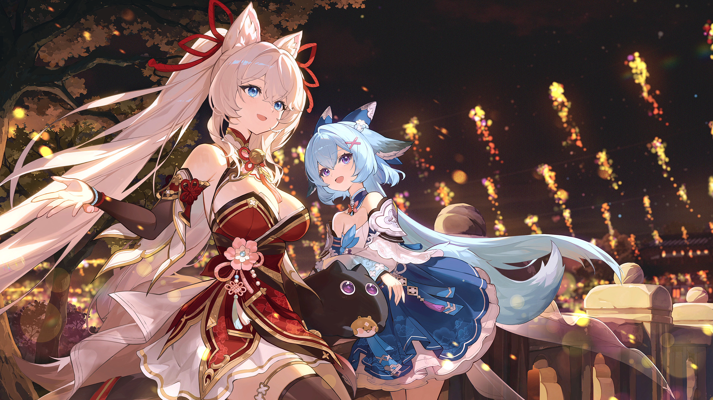

# Mei.YUi
<i>

## Hello friend

  
  

  

---

## Personal File
- **Favorite Characters**: Narae （🙂）, Mina（😍）, Mabel（💕）（They all come from《MONGIL: STAR DIVE》）
- **Hobbies & Interests**: Mathematics, Physics, Painting (Sketch, Printmaking, Comics)

## Countries and Regions
- **favorite countries：South Korea(한국)、Japan(にほん)、China (中国)、US（USA）  
---
## My social account
[Mei.YUi's webpage](https://meiyui.dev)

---

## My favorite programming languages and frameworks

